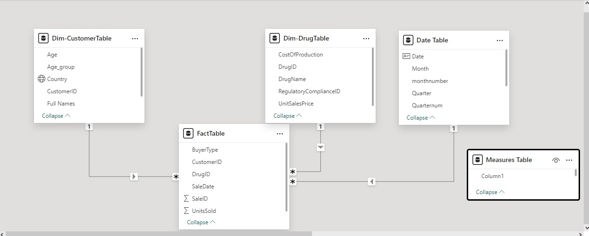
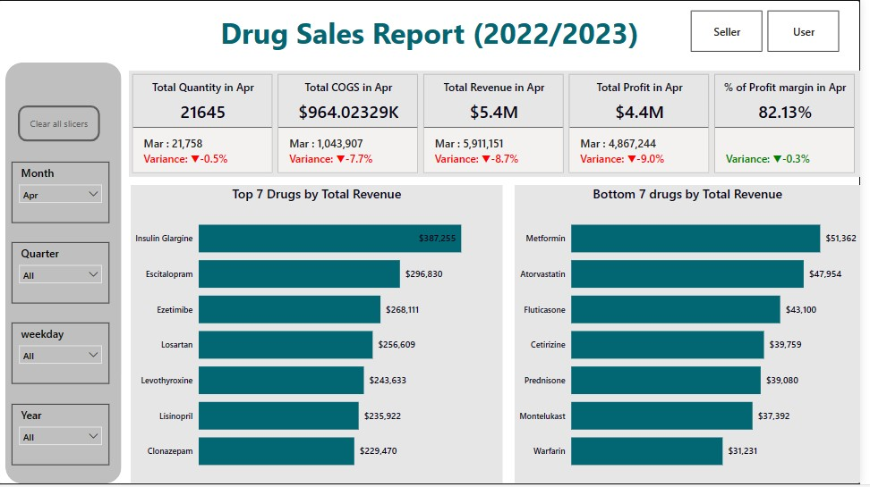
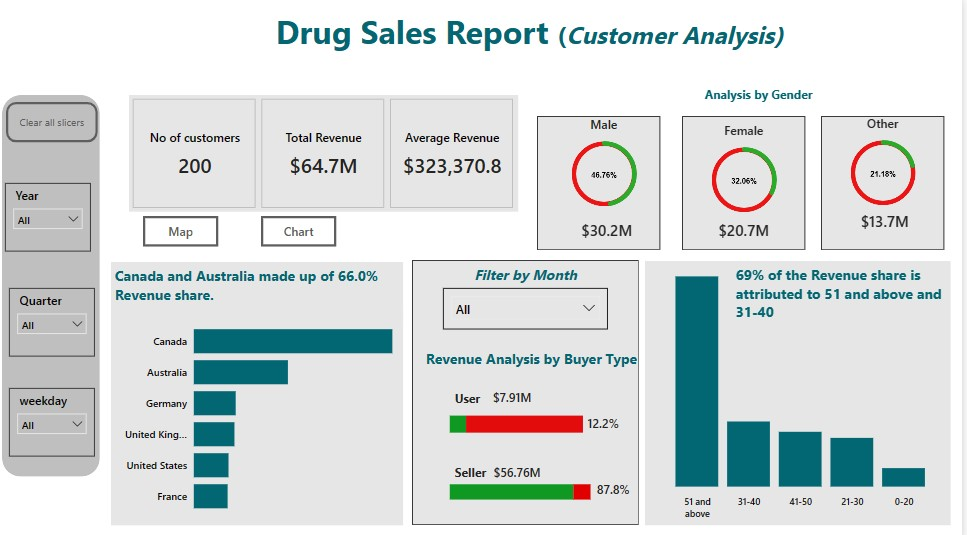
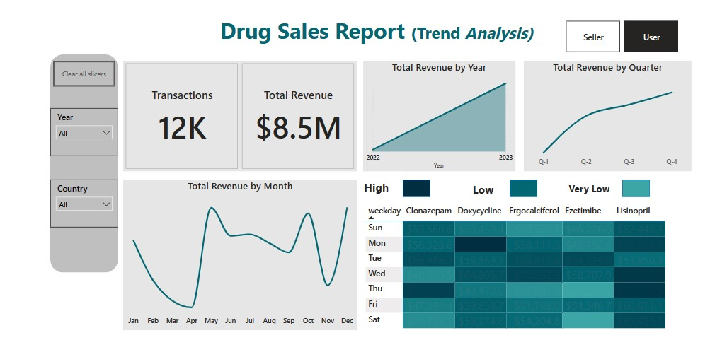

# Drug sales Analysis

## INTRODUCTION

A retail store has hired me as a Business Intelligence Analyst to review their data and provide insights that will be valuable to the CEO and COO of the business. The data was obtained from Kaggle.

## Problem Statement

The CEO of the retail store is interested in viewing the time series of the revenue data for the years 2022 and 2023 only. He would also like to see the top-performing and underperforming drugs, as well as a customer analysis.

## Data Transformation
Data was efficiently cleaned and transformed with power query editor of power bi 

## Power Bi Concepts applied
•	Dax Concepts: Calendar Auto(), Year(), Month(), Monthnum(), Weekday(), Weeknum(), Quarter(), Quarternum(), Measures()

Data Modelling: star Schema 

## Data Modelling
• Power bi automatically connected related tables resulting in a star schema model. The Fact Table and Date Table was connected together 

## Data Visualization

The first dashboard focuses on the sales analysis for 2022-2023. Based on my analysis, certain months experienced growth while others did not. Overall, there has been an increase in revenue from 2022 to 2023. The top 7 performing drugs based on total revenue are Doxycycline, Ergocalciferol, Lisinopril, Clonazepam, Ezetimibe, Valacyclovir, and Albuterol. The 7 underperforming drugs are Hydrochlorothiazide, Fluticasone, Metformin, Prednisone, Amoxicillin, Montelukast, and Warfarin.

The second dashboard focuses on customer analysis. There are 200 customers from 6 different countries: Canada, Australia, the United States, the United Kingdom, Germany, and France. Canada and Australia contribute the most revenue, making up 66.0% of the total.

A significant portion of the revenue, 69%, comes from customers in the age groups 51 and above and 31-40.

Customers are categorized as either buyers or sellers. Those who buy the drugs for personal use contribute approximately $7.91 million in revenue, while customers who are sellers contribute $56.76 million in revenue.

The third dashboard focuses on trend analysis. The total number of transactions from 2022-2023 was approximately 12,000. There has been an overall increase in revenue from 2022 to 2023, with a consistent increase across quarters 1 to 4. However, there have also been both upward and downward trends in monthly revenue throughout this period.

To interact with the dataset click [here](https://app.powerbi.com/groups/me/reports/42fc8eb5-0dd2-413e-8cfc-5d22a77e2c78/ReportSection2cc07c22a4d2b443712a?experience=power-bi)

